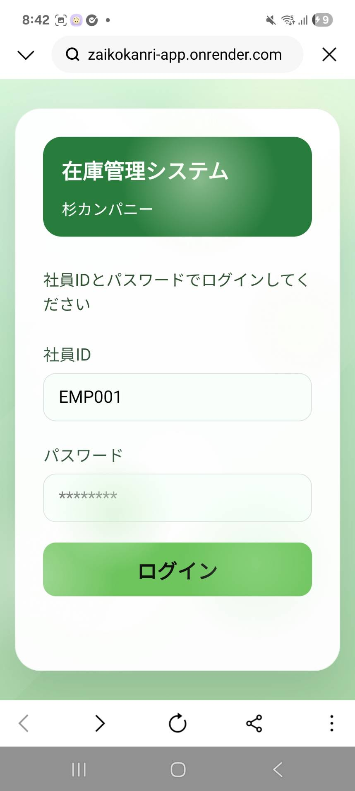
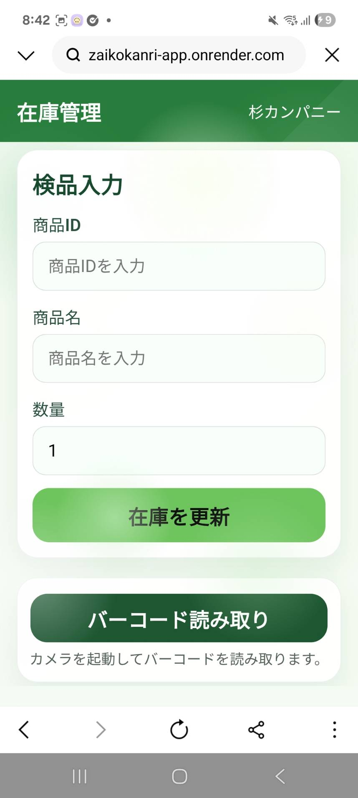
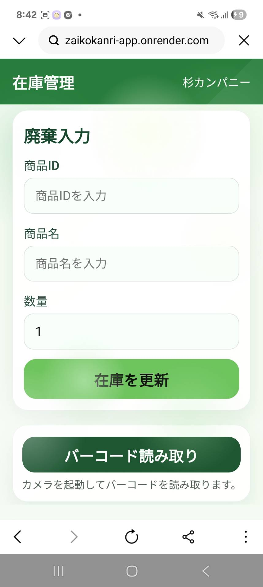
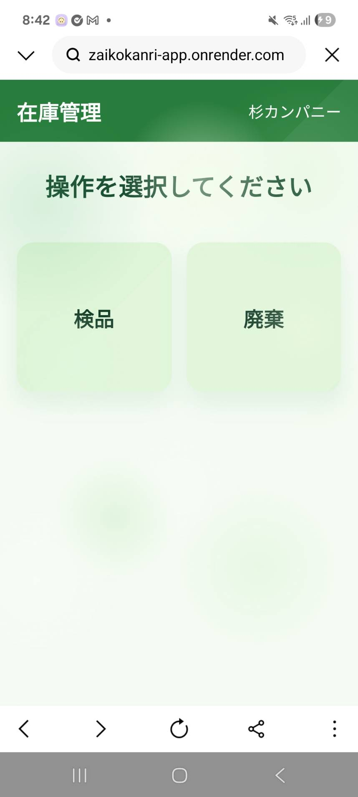

アプリ名：在庫管理アプリSUGI

内容：コンビニや小売店の販売や廃棄による在庫の変動をこのアプリ一つで管理し、発注まで行えます。店員側と店長側で機能を分けることでセキュリティ面に配慮しつつ安全に在庫の管理が行えます。

画面の写真

  
  
  
  

デモ：実際にアプリを操作できます。（デモアカウント：社員ID：EMP001,パスワード：tanaka123）

Webアプリ：https://zaikokanri-app-one.vercel.app/  API:https://zaikokanri-app.onrender.com

開発背景・目的

実際の店舗業務を想定して、商品の在庫数をWeb上で管理できる在庫管理システムを開発しました。私自身学生時代セブンイレブンで働いており、その際に使っていたモバイル型在庫管理アプリが真っ先に制作物のアイデアとして思いついたので制作を始めました。さらにこの開発を通じて、フロントエンドだけでなく、API・バックエンド・データベース・デプロイまで含めたWebアプリ開発の一連の流れを学ぶことを目的としました。

主な機能 
ログイン機能   商品一覧表示   商品在庫数の表示   検品、販売、廃棄による在庫変更   在庫不足アラート   在庫変動履歴の記録   MySQLでのデータ管理   従業員の操作履歴管理

使用技術 
フロントエンド：HTML,CSS,Javascript 
バックエンド：Node.js,Express 
データベース:MySQL 
セキュリティ:bcrypt 
テスト:Supertest(単体テスト,結合テスト,統合テスト) 
開発環境:Git,GitHub,Visual Studio Code 
デプロイ:Vercel,Render,Railway

工夫した点・苦労した点 
①工夫した点 
→在庫数の不整合防止 
販売・廃棄によって在庫数が減少する際、
在庫数が0未満にならないように制御しました。
フロントエンドだけで制御するのではなく、
バックエンド側でも在庫数を確認することで、
不正なリクエストによる在庫数の不整合を防ぐことを意識しました。

在庫操作のログ管理 
在庫数を変更するだけではなく、
「誰が」「どの商品に」「どの操作を」「いつ行ったか」
をstock_logsテーブルに記録するようにしました。
これにより、在庫数が変化した原因を後から確認できるようにしました。

パスワードのセキュリティ 
ユーザーのパスワードを平文でデータベースに保存せず、
bcryptを使用してハッシュ化して保存しました。
ログイン時には入力されたパスワードと、
データベースに保存されたハッシュ値を比較して認証しています。

②苦労した点 
→在庫操作後にログが正しく保存されない問題 
在庫変更自体は正常に動作していましたが、
2回目以降の操作でstock_logsテーブルにNULLが
保存される問題が発生しました。
原因をフロントエンドからバックエンド、
データベースへのデータの流れを確認しながら調査しました。
最終的にIDやユーザーIDの型を明示的に変換し、
入力値のバリデーションを追加することで問題を解決しました。
この経験から、エラーが発生した箇所だけを見るのではなく、
フロントエンド → API → バックエンド → DBという
データの流れ全体を確認することの重要性を学びました。

🔧 開発で苦労した点 
API連携やデータベース連携を一から調べながら実装したことです。開発中は多くのエラーが発生しましたが、エラーメッセージやデータの流れを確認し、原因を一つずつ追究しました。試行錯誤を繰り返しながら最後まで実装をやり切ったことで、未知の技術でも自ら調べて解決する力を身につけました。